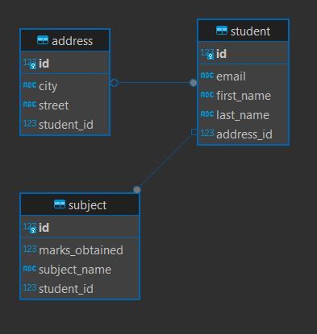

# Spring JPA - Basic Application

### Reference Documentation

* Swagger - http://localhost:8081/demo/swagger-ui/index.html#/student-controller/getAllStudents
* Get All API - http://localhost:8081/demo/api/student/getAll
* Please add config in local config/secret manager

````
spring.datasource.url=jdbc:postgresql://localhost:5432/
spring.datasource.username=postgres
spring.datasource.password=postgres
````

* Entity Relationship Diagram
    * Note: Student - Address is one-to-one relationship
      

* Project requirements
    * Maven
    * Java 21
    * Intellij
    * Postgres db (local/cloud)