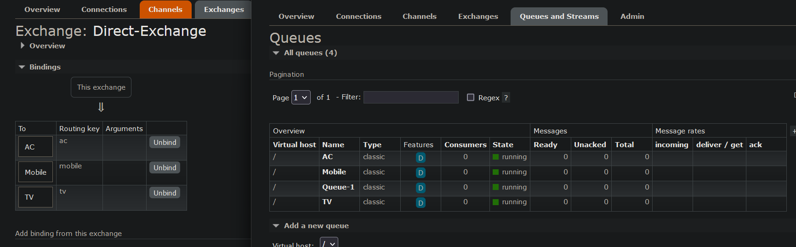
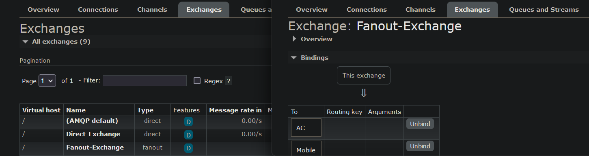

# RabbitMQ : Messaging with Spring Boot

### Reference Documentation

* Swagger - http://localhost:8082/mongo-db/swagger-ui/index.html#/
* Get All API - http://localhost:8082/mongo-db/api/student/all
* Project requirements
    * Maven
    * Java 21
    * Intellij
    * Rabbit MQ
* Each type of publisher/consumer present in

````
package com.demo.rabbitmq
````

* RabbitMQ Exchanges:
    * Real Time (with JSON)
        * Queue-1
    * Direct-Exchange [_type=direct_]
        * 
        * AC
        * TV
        * Mobile
    * Fanout-Exchange [_type=fanout_]
        * 
        * AC
        * Mobile